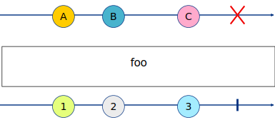

# About
This is yet another marble diagram generator for documenting Reactive Extensions sources and operators.

# Features

* generating SVG graphics files from a simple text description
* unlimited number of source observable and operator lines
* error `#`, completion `|` or infinity `...` symbol terminating the timeline
* notation for multiple characters long values with `(...)` brackets
* notation for groupped values with `{...}` brackets
* support for observables of observables (2nd order)
* adjusting starting point of a timeline with number of `.` characters at the begining of a timeline 
* easier visual adjustment between timelines in source files with white spaces in timeline
* scaling dimension of a default SVG view box for generated diagrams 
* autocoloring identical values 
* generation multiple diagram images from a single file (batch mode)

# Example
To run it, you need Python 2.7.x with `pyparsing` module installed.

A simple text file `foo.txt` with marble diagram can look like this:

	marble foo_example
	{
		source a:     +--A-B--C-#
		operator foo: +--1-2--3-|
	}

To generate SVG image out of it, you can run:

	python marblegen.py foo.txt 
	
This will produce the following diagram:

	

# Other generators

* [rxmarbles](https://github.com/staltz/rxmarbles)
* [aheckmann/gm](https://github.com/aheckmann/gm)
